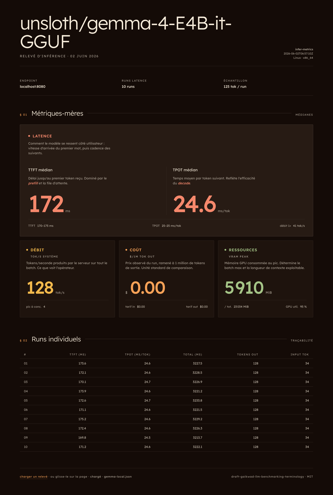
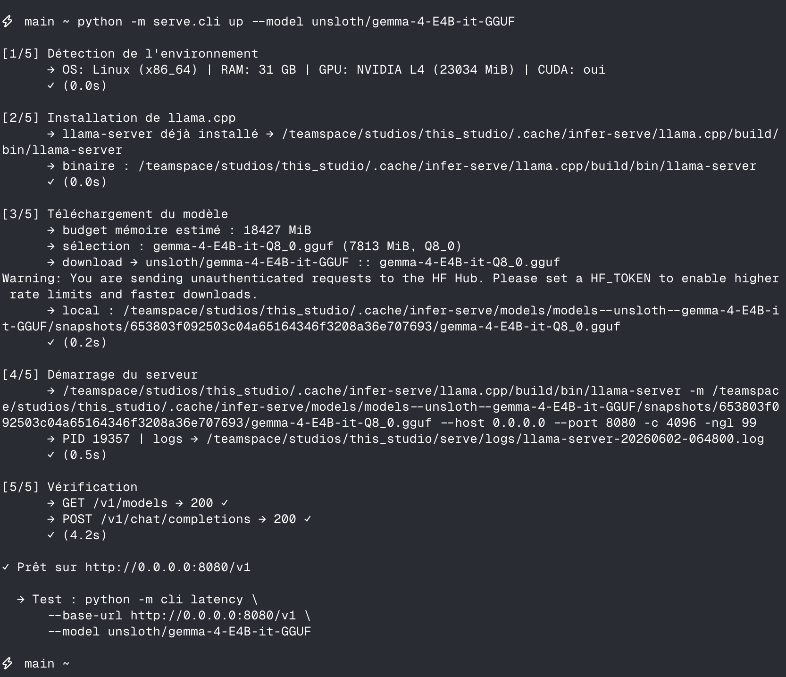
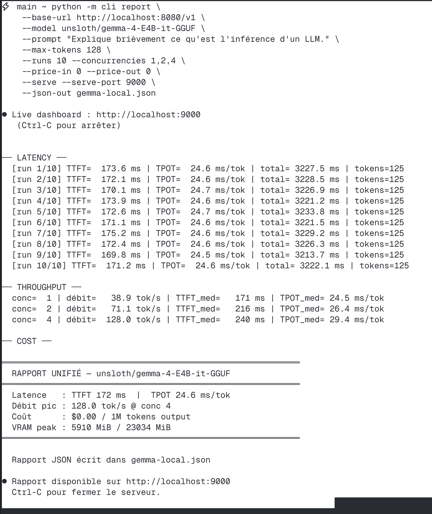

# infer-metrics

> Mesure les 4 métriques-mères de l'inférence LLM sur n'importe quelle API OpenAI-compatible.
> Et héberge un modèle GGUF en une commande avec `infer-serve`.



---

## Usage

```bash
uv pip install -r requirements.txt
```

**Mesurer** un endpoint existant (OpenAI, Groq, Together, vLLM, llama.cpp…) :

```bash
python -m cli report \
  --base-url https://api.openai.com/v1 \
  --model gpt-4o-mini \
  --runs 5 --concurrencies 1,4 \
  --json-out report.json
```

→ ouvre `dashboard.html` et glisse-dépose ton `report.json` pour visualiser.

**Héberger** un modèle GGUF localement (llama.cpp, endpoint OpenAI-compat) :

```bash
python -m serve.cli up                 # défaut : unsloth/gemma-4-E4B-it-GGUF
python -m serve.cli status
python -m serve.cli down
```

`up` enchaîne : détection env → install llama.cpp → download GGUF (quant auto selon RAM/VRAM) → lance `llama-server` → vérifie `/v1/models`.



---

## Le modèle mental : 4 familles

Découpage aligné sur le draft IETF [`draft-gaikwad-llm-benchmarking-terminology`](https://datatracker.ietf.org/doc/html/draft-gaikwad-llm-benchmarking-terminology).

| Famille | Métrique-mère | Sous-commande |
|---|---|---|
| **Latence** | TTFT + TPOT | `latency` |
| **Débit** | Output tokens/sec (système) | `throughput` |
| **Coût** | $ / 1M tokens output | `cost` |
| **Ressources** | VRAM peak (NVIDIA local) | `resources` |
| **Tout-en-un** | JSON + résumé texte | `report` |

- **TTFT** : délai jusqu'au 1er token. Dominé par le *prefill*. Métrique critique du ressenti utilisateur.
- **TPOT** : `(latence_totale - TTFT) / (n_tokens - 1)`. Reflète l'efficacité du *decode*.



---

## Limites

- Mesure **côté client** (inclut le réseau). Pour isoler le serveur, lance depuis la même machine.
- Comptage de tokens via chunks streamés (≈ tokens, pas garanti exact).
- Pas de P95/P99 — il faut ≥ 1000 runs (cf. §5.3 du draft IETF). À venir.
- Qualité de réponse : hors scope (demande un dataset d'éval).

## Licence

MIT.
